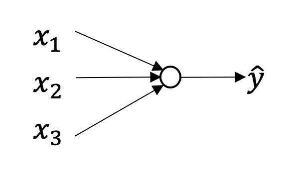
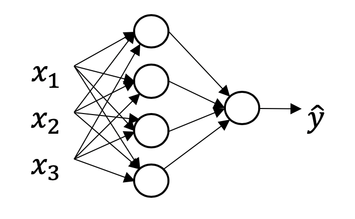
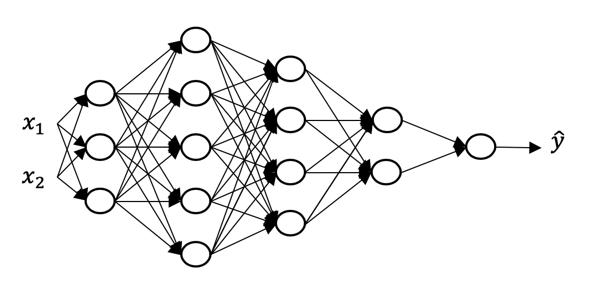
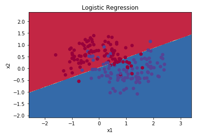
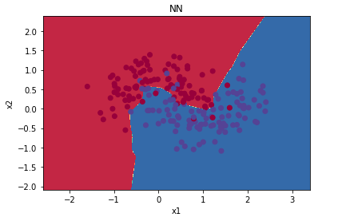
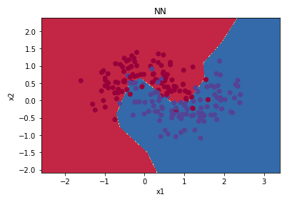
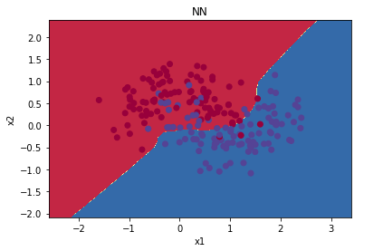

# Deep-Learning-From-Scratch

This repo hosts projects on Deep learning. They are built from scratch using object oriented programming (OOP). Numpy is used and the calculations are vectorized for efficiency. Detailed discriptions are as below.

---
## 1. Linear Regression using Gradient Descent

([Here is the notebook] (https://github.com/yuehu9/Deep-Learning-From-Scratch/tree/master/1_Linear_Regeression_with_Gradient_Descent)

As a warm up, this project use gradient desecent to fit a least square model. (I know, a closed form solution could do this. Anyway, not harm as an excercise.) It considers both the case of one and multi varaibles as input feature. 

* Linear regression fitting profit as a function of city population.

## 2. Logistic Regression

([Here is the notebook] https://github.com/yuehu9/Deep-Learning-From-Scratch/tree/master/2_Logistic_Regression)

This porject builds a logistic regression model from scratch using numpy. Gradient descent is used for training, and the back propogation is vectorised for efficiency. MNIST dataset is used, the task is to classify digits as 4 or not 4. 

*  Network structure

 

* Outcome

 

 
 
 The effect of training set size and learning rate.
 
 ## 3. One layer Neural network

([Here is the notebook] https://github.com/yuehu9/Deep-Learning-From-Scratch/tree/master/3_One_Layer_NN)

We still use MNIST dataset, and consider the task of classifying digits as 4 or not 4. One fully connected hidden layer is added to introduce nonlinearity. ReLu and tanh activation function is implemented. The impact of the learning rate, number of hidden units, and activation function of the hidden layer is investigated.

*  Network structure

 
 

 ## 4. Multi layer fully connected neural network

([Here is the notebook] https://github.com/yuehu9/Deep-Learning-From-Scratch/tree/master/4_deep_feed_forward_network)

We still use MNIST dataset, and consider the task of classifying digits as 4 or not 4. Multiple fully connected hidden layer is added to introduce nonlinearity.  The impact of the learning rate, number of layers, number of hidden units in each
layer, and activation function of the hidden layers is investigated. The result shows that without regularization, 3 fully connected layers is the deepest we can go and still achieve adequate performance.

*  Network structure

 

 ## 5. Regularization for neural network

([Here is the notebook] https://github.com/yuehu9/Deep-Learning-From-Scratch/tree/master/5_DL_regularization)

This project investigates two regularizaition techniques in neural network: l2 norm regularizaition and drop out.

The moons dataset is used (http://scikit-learn.org/stable/modules/generated/sklearn.datasets.make_moons.html). The data set consists of two classes of 2-dimensional points (blue and red) that are randomly generated based on two interleaving circles to visualize classification algorithms. The objective is binary classification to separate the two classes.

** Results
First, we try a logistic regression which outputs a linear boundary.

Then, we apply a 3-layer nerual network. The unregularized network overfits the data. We can se that there is zig-zag conturs trying to fit the noise.

Under l2 norm regularization on the size of parameters, the countur is smoother. The testing accuracy is higher than training. This indicates that overfitting problem is mitigated.

Drop out has simmilar effect of regularization. Under 0.5 dropout rate the network is actually underfitting the data.

 ## 6. Stochastic gradient descent
 ([Here is the notebook] https://github.com/yuehu9/Deep-Learning-From-Scratch/tree/master/6_SGD

Basic SGD algorithms are implemented in numpy, including minibatch SGD and minibatch SGD with momentum.
We still use MNIST dataset, and consider the task of classifying digits as 4 or not 4.

 ## 7. Stochastic gradient descent
 ([Here is the notebook] https://github.com/yuehu9/Deep-Learning-From-Scratch/tree/master/7_Adam
 
 Adam optimization is implemented from scratch in numpy. We still use MNIST dataset, and consider the task of classifying digits as 4 or not 4.
