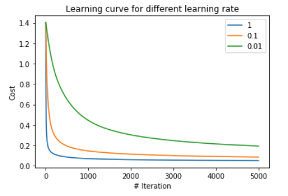

# Deep-Learning-From-Scratch

This repo hosts projects on Deep learning. They are built from scratch using object oriented programming (OOP). Numpy is used and the calculations are vectorized for efficiency. Detailed discriptions are as below.

---
## 1. Linear Regression using Gradient Descent

([Here is the notebook] (https://github.com/yuehu9/Deep-Learning-From-Scratch/tree/master/1_Linear_Regeression_with_Gradient_Descent)

As a warm up, this project use gradient desecent to fit a least square model. (I know, a closed form solution could do this. Anyway, not harm as an excercise.) It considers both the case of one and multi varaibles as input feature. 

* Linear regression fitting profit as a function of city population.

## 2. Logistic Regression

([Here is the notebook] https://github.com/yuehu9/Deep-Learning-From-Scratch/tree/master/2_Logistic_Regression)

This porject builds a logistic regression model from scratch using numpy. Gradient descent is used for training, and the back propogation is vectorised for efficiency. MNIST dataset is used, the task is to classify digits as 4 or not 4. 

 
 
 * The effect of training set size and learning rate is investigated.
 
 
